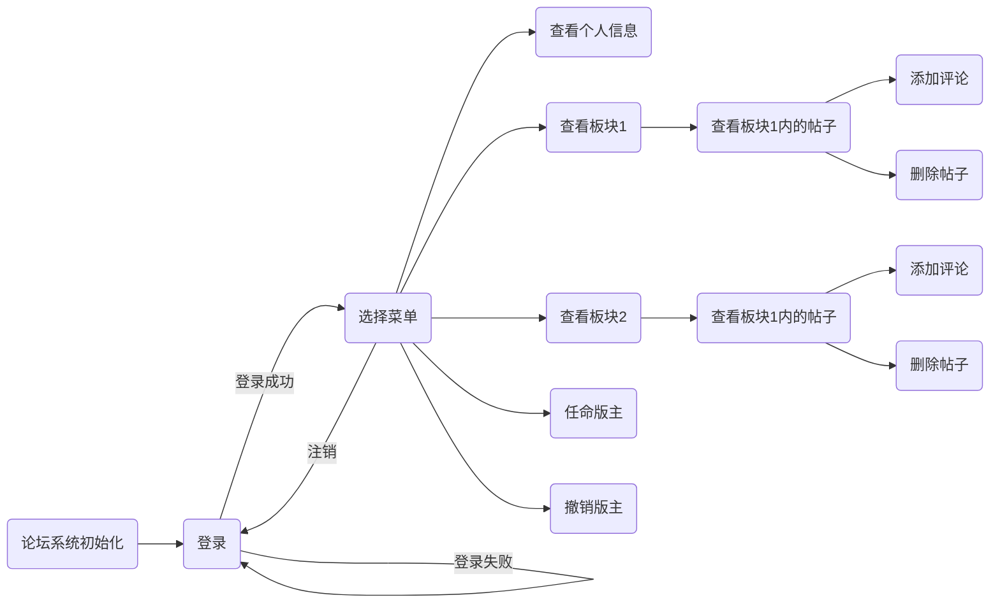
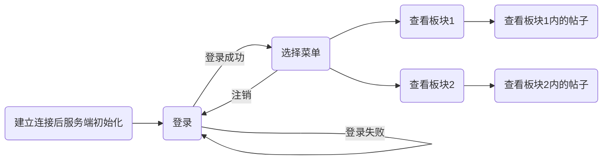

# 1. C++论坛第一版

因为第一版是第二版的真子集，所以在这里不做过多阐述，下面将对第二版及第三版进行详细介绍。

# 2. C++论坛第二版

设计实现一个C++学习论坛系统，作为学生和老师的交流平台。通过该系统的设计，培
养学生综合利用 C++语言进行面向对象程序设计的能力。 


## 2.1 功能要求
系统面向二类用户：普通用户（版主）、管理员。两者都有自己的用户名和密码，能够进行登录登出操作，还可以查看自己的个人信息。断电不丢失信息，支持匿名查看论坛功能。

**普通用户**

 - 发帖：用户可以选择在某一板块发帖
 - 评论：用户可以在某一帖子下评论
 - 查看：查看论坛当前已有的板块及各版块下的帖子
 - 删帖：删除自己发布的还没有评论的某一帖子
 - 可以被管理员升级为某一板块的版主

**版主**

 - 进行普通用户的一切操作
 - 删帖：删除其管理板块下的某一帖子（不管有没有被评论）
 - 可以被管理员撤职降级为普通用户

**管理员**

 - 查看：查看论坛当前已有的板块及各版块下的帖子
 - 任命和撤销版主的操作
 
**匿名用户**
 - 只可以对论坛进行查看板块及板块下的帖子的操作

**文件操作**

 - 断电不丢失数据，即对用户和帖子信息等进行本地保存
 - 对文件流进行重载操作

## 2.2 用户类的继承及其他类
### 2.2.1用户类


- #### User类

```c
 class User
{
private:
	string id;				//用户id
	string username;		//用户名
	string password;		//密码

public:
	User();

	~User();

	User(string username, string password, string id);

	void Log_in(string username, string password, Forum *forum);//登录函数

	void Log_out(Forum *forum);							//登出函数

	void CheckIdentification();							//查看个人信息

	string GetUsername();								//返回用户名

	string GetPassword();								//返回密码

	string GetId();										//返回id

	void SetUsername(string username);					//设置用户名

	void SetPassword(string password);					//设置密码

	void SetId(string id);								//设置id

	virtual void CheckSection(string section,Forum *forum);	//查看section板块

	void CheckPost(Forum *forum,string section);			//查看section中的帖子及其评论

	void OnlyCheckPost(Forum *forum, string section);		//只查看section中的帖子及其评论

	virtual void DeletePost(int PostOrder, Forum *forum);	//删除帖子

	friend ofstream& operator<<(ofstream &output, User *user);//重载：输出到文件
	
	friend ifstream& operator>> (ifstream &input, User *user);//重载：从文件读出到内存
};
```
User类是用户类的基类，**成员变量**有username,id,passoword，**成员函数**有查看个人信息函数，查看板块函数，查看帖子函数，删除帖子函数，对文件流的重载函数等，以及**虚函数**删帖函数。
- #### OrdinaryUser类

```c
class Ordinaryuser :
	public User
{
public:
	Ordinaryuser();
	~Ordinaryuser();

	Ordinaryuser(string username, string password, string id);

	void MakeComment(int TempPostId, string TempId, string TempContent, Forum *forum);//评论

	void MakePost(string TempUserId, string TempPostTitle, string TempContent, string TempSection, Forum *forum);	//发帖
	
	int IsDeletePost(int PostOrder, Forum *forum);	//是否可以被删除，返回2已经有评论,1没有评论但不是自己发的,0可以删除

	void DeletePost(int PostOrder, Forum *forum);	//删除帖子
};
```
Ordinaryuser类是User类的子类，继承了User类的属性和方法，但是自己有User类没有的发帖、发评论函数等。该类重写了删帖函数这一**虚函数**，方便主函数的父类指针调用子类对象的方法。
- #### Moderator类

```c
class Moderator :
	public Ordinaryuser
{
public:
	string section;//所管理的版

	Moderator();

	Moderator(string username, string password, string id,string section);

	~Moderator();

	void DeletePost(int PostOrder, Forum *forum);//版主无条件删除帖子

	string GetSection();			   		 	 //返回版主管理的板块

	void SetSection(string section);	   		 //设置版主管理的板块

	friend ofstream& operator<<(ofstream &output, Moderator *moderator);//写出到文件

	friend ifstream& operator>>(ifstream &input, Moderator *moderator);//写出到文件
};
```
**Moderator类**继承了普通用户，重写了**虚函数**删帖函数（无条件删除自己板块下的帖子），多了自己所管理的板块这一属性。
- #### Administrator类

```c
class Administrator :
	public User
{
public:

	Administrator();

	Administrator(string username,string password,string id);

	~Administrator();

	void Appoint(string username, string section,Forum *forum);//任命版主

	void Cancel(string username, Forum*forum);//撤职版主

};
```
**Adiministrator类**是从User类继承来的子类，为管理员类。该类的成员函数有**任命版主**以**及撤销版主**的函数
- #### Anonymity类

```c
class Anonymity :
	public User
{
public:
	Anonymity();

	Anonymity(string username, string password, string id);

	~Anonymity();
};
```

### 2.2.2 其他类(Post,Comment,Forum)

- #### Post类

```c
class Post
{
private:
	int id;		//帖子id
	string userid;	//发帖者id
	string title;	//帖子标题
	string content;	//帖子内容
	string thistime;//发帖时间
	string section;	//所在版块
public:
	Post();
	~Post();

	vector <Comment*> comments;				//帖子容器

	friend class User;

	Post(string TempUserId, string TempTitle, string TempContent, string TempSection);

	void SetId(int id);

	int GetId();							//返回帖子id

	string GetPostUserid();					//返回发帖者

	string GetTime();						//返回发帖时间

	string GetPostTitle();					//返回帖子题目

	string GetPostContent();				//返回帖子内容

	friend ifstream& operator>> (ifstream &input, Post *post);	//重载流运算符使其可以写入对象

	friend ofstream& operator<<(ofstream &output, Post *post);	//写出到文件
};
```
**Post类**有**私有变量**：帖子id，发帖者id，帖子标题，帖子内容，发帖时间，帖子所在板块
**Post类**有**成员函数**：set和get变量的函数，以及对文件流的**重载函数**。

- #### Comment类 


```c
class Comment
{
private:
	string id;	//评论者id
	string content;	//评论内容
	string thistime;//评论时间
public:
	Comment();
	~Comment();
	
	Comment(string TempId, string TempContent);	//

	string GetTime();//返回现在的时间

	string GetThistime();//返回评论时间

	string GetUserId();//返回评论人id

	string GetContent();//返回评论内容

	void SetThisTime(string ThisTime);//设置评论时间

	void SetUserId(string UserId);//设置评论者id

	void SetContent(string Content);//设置评论内容

	friend ofstream& operator<<(ofstream &output, Comment *comment);//写入到文件
};
```
**Comment类**有**私有变量**：评论者id，评论内容，评论时间
**Comment类**有**成员函数**：set和get变量的函数，以及对文件流的**重载函数**。

- #### Forum类 

```c
class Forum
{
public:

	Forum();

	~Forum();

	int count;

	int state;//有限状态自动机的状态

	Ordinaryuser* NewOrdinaryuser;

	Moderator* NewModerator;

	Administrator* NewAdmin;

	Anonymity* NewAnonymity;

	vector <Post*>  posts;	//储存所有帖子

	int post;				//标记正在查看的帖子id

	string section;			//标记正在查看的板块

	vector <Ordinaryuser*> ordinaryusers;	//储存所有的普通用户
	
	vector <Moderator*> moderators;			//储存所有的版主

	vector <Administrator*> administrators;//储存所有的管理员

	vector<Anonymity*> anonymity;

	Post* FindPost(int TempPostId);

	void Menu();		//登录后的菜单栏函数

	void MainMenu(Forum *forum);

	void AdminMenu(Forum *forum);				//管理员的菜单栏

	void AnonyMenu(Forum *forum);				//匿名用户的菜单栏函数

	void Init();				 				//论坛系统的初始化：读帖子文件，读用户信息文件

	void login(string username, string password);//登录函数

	void InputLoginInfo();						//打印个人信息

	void MakeOrdinaryUser(string username, string password, string id);	//new一个普通用户

	void MakeModerator(string username, string password, string id,string section);//new一个版主

	void MakeAdmin(string username, string password, string id);	//new一个管理员

	void MakeAnomy(string username, string password, string id);	//new一个匿名用户

	void CheckOrdId(Ordinaryuser *user);	//查看普通用户信息

	void CheckModId(Moderator *user);		//查看版主信息

	void CheckAdmin(Administrator *user);	//查看管理员信息

	void OrdSetPost(Ordinaryuser *user);	//发帖函数

	void ModSetPost(Moderator *user);		//发帖函数

	void OrdSetComment(Ordinaryuser *user,int post);		//发送评论

	void ModSetComment(Moderator *user, int post);			//发送评论

	void OrdDeletePost(Ordinaryuser *user,Forum *forum);	//删帖函数

	void ModDeletePost(Moderator *user, Forum *forum);

	void SetModerator(Administrator *user, Forum *forum);	//任命版主

	void DeleteModerator(Administrator *user, Forum *forum);//撤职版主

	void SaveAllPosts();			//向文件中保存所有帖子

	void ReadPost();				//从文件中读取帖子信息

	void SaveAllOrd();				//向文件中保存普通用户信息

	void SaveAllModerator();		//向文件中保存所有版主信息

	void ReadOrds();				//读取普通用户信息
	
	void ReadModerators();			//读取版主信息

	void SaveAllAdmin();			//保存所有管理员信息

	void ReadAllAdmins();			//从文件中读取所有管理员信息

	void UserReadError();			//文件读取错误处理函数
};
```
Forum类顾名思义为论坛类。其中有vector容器来储存所有的帖子。其函数头及函数的使用方法在注释中显示。


## 2.3 主函数状态自动机


## 2.4 文件流重载


### 2.4.1 对Comment类重载


 - 对<<操作符的重载
 

```c
ofstream& operator<<(ofstream &output, Comment *comment)
{
	output << comment->GetThistime() << endl;
	output << comment->GetUserId() << endl;
	output << comment->GetContent() << endl;
	return output;
}
```

 - 对>>操作符的重载
 
 从文件中读出评论的操作在**Post**的>>操作符重载中完成
 
### 2.4.2 对Post类重载

 - 对<<操作符的重载
 
**设计思路**：以10个#作为每个帖子的开头，按顺序每行输出到文件中存储所有帖子及其评论的信息。

```c
ofstream& operator<<(ofstream &output, Post *post)
{
	output << "##########" << endl;
	output << post->thistime << endl;
	output << post->userid << endl;
	output << post->title << endl;
	output << post->content << endl;
	output << post->section << endl;
	for (int i = 0; i < post->comments.size(); i++)
		output << post->comments[i];
	return output;
}
```

 - 对>>操作符的重载
 
 **设计思路**：在文件中已有信息的情况下，按行读取。每读到10个#新建一个Post类的实例对象，当读取了5行后，剩下的每三行为一个评论信息，直到读到下一个Post为止。以此类推，直到文件结束。
 
```c
ifstream& operator>>(ifstream &input, Post *post)
{
	string line;
	getline(input, line);
	if (line == "##########")
		getline(input, line);
	post->thistime = line;
	getline(input, line);
	post->userid = line;
	getline(input, line);
	post->title = line;
	getline(input, line);
	post->content = line;
	getline(input, line);
	post->section = line;
	getline(input, line);
	while (line != "##########" && !input.eof())
	{
		Comment *comment = new Comment;
		comment->SetThisTime(line);
		getline(input, line);
		comment->SetUserId(line);
		getline(input, line);
		comment->SetContent(line);
		post->comments.push_back(comment);
		getline(input, line);
	}
	return input;
}
```

### 2.4.3 对User类重载
 - 对>>操作符的重载
 
 **设计思路**：向文件中按行输出用户信息（用户名、密码、id）
```c
ofstream& operator<<(ofstream &output, User *user)
{
	output << user->username << endl;
	output << user->password << endl;
	output << user->id << endl;
	return output;
}
```

 - 对>>操作符的重载
 
**设计思路**：从文件中按行读取用户信息（用户名、密码、id）

```c
ifstream& operator>>(ifstream &input, User *user)
{
	string line;
	getline(input, line);
	user->username = line;
	getline(input, line);
	user->password = line;
	getline(input, line);
	user->id = line;
	return input;
}
```


## 2.5 错误处理及异常

  ### 用户输入错误处理
 	
|输入错误类型|解决方法  |
|:----:|:----:|
| 账号密码错误 |  提示重新输入账号密码|
|操作指令输入错误  | 提示重新输入操作指令 |
| 输入帖子序号错误 | 提示错误类型（帖子不存在或帖子不在该板块下）并重新输入 |
|任命普通用户为版主时普通用户名输入错误  | 提示重新输入 |
|任命普通用户为版主时板块输入错误  | 提示重新输入 |
|撤职版主时版主用户名输入错误  | 提示重新输入 |
|胡乱输入非法字符  | 吞掉非法字符并提示重新输入 |

  ### 文件异常处理
|文件异常类型|解决方法  |
|:----:|:----:|
| Post.txt为空 |  提示论坛系统文件为空，可以继续操作|
|Post.txt不存在  | 新建一个空文件，并继续操作 |
| ords.txt和Moderator.txt同时为空或不存在 | 提示数据库异常，程序退出|
|ords.txt和Moderator.txt有一个不为空  | 新建一个空文件，并继续操作 |
|Admins.txt为空或不存在 |  提示数据库异常，程序退出|

## 2.6 第二版测试用例

 - **登录**
 
 
 - **查看板块**
 
 
 - **查看帖子**
 
 
 
 - **发评论**
 
 
 - **删帖**
 
 
 - **查看个人信息**
 
 
 - **发帖**
 
 
 
 
 - **匿名登录**
 
 
 
 - **文件读取**
 
在测试的时候张三发了新帖子：孙悟空到底有几个女妖精的朋友啊？
现在打开Post.txt文件进行查看：


关闭程序后再次运行程序发现没有任何错误：


 - **管理员操作**：任命张三为宿舍夜聊版主来把宿舍夜聊的内容全部删掉


 
 进行一系列的删除操作后：
 
 
 
 再来看看Post.txt中，已经没有了宿舍夜聊板块的帖子：
 
 
  - **文件异常操作**:
  
  
  
  
  - 注销


# 3. C++论坛第三版

## 3.1 功能需求

 - 目的：在第二版程序的基础之上，继续完善和丰富C++学习论坛系统的功能，并在完善过程中学习和体会程序设计和代码重构等思想和实践思想。
 - 功能要求：
 	1. 查看论坛当前已有板块和各版块下的帖子
 	2. 系统登录
 	3. 系统注销
 -  网络访问功能使用了Socket API，采用了客户端/服务器（C/S）处理模型，客户端主要完成界面交互功能，接收用户输入数据、显示服务端处理结果等。服务端主要完成存储和计算等处理功能，如完成登录/注销功能、存储数据、查看帖子等。

## 3.2 SOCKET的使用（TCP）
### 3.2.1 服务器端

服务器端编程的步骤：

1. 加载套接字库，创建套接字(WSAStartup()/socket())；

2. 绑定套接字到一个IP地址和一个端口上(bind())；

3. 将套接字设置为监听模式等待连接请求(listen())；

4. 请求到来后，接受连接请求，返回一个新的对应于此次连接的套接字(accept())；

5. 用返回的套接字和客户端进行通信(send()/recv())；

6. 返回，等待另一连接请求；

7. 关闭套接字，关闭加载的套接字库(closesocket()/WSACleanup())。
```c
	int flag = 1;
	char recvBuf[1024];
	Forum *forum = new Forum;
	//1.启动SOCKET库，版本为2.0
	WORD wVersionRequested;
	WSADATA wsaData;
	int err;
	wVersionRequested = MAKEWORD(2, 0);
	err = WSAStartup(wVersionRequested, &wsaData);
	if (err != 0)
	{
		cout << "Socket2.0初始化失败，Exit!";
		return 0;
	}
	if (LOBYTE(wsaData.wVersion) != 2 || HIBYTE(wsaData.wVersion) != 0)
	{
		WSACleanup();
		return 0;
	}

	//2.创建套接字,用于监听
	SOCKET sock;
	sock = socket(AF_INET, SOCK_STREAM, 0);
	if (sock == INVALID_SOCKET)
	{
		cout << "Socket 创建失败，Exit!";
		return 0;
	}

	//3.绑定
	SOCKADDR_IN myaddr; //sockaddr_in相当于sockaddr结构
	memset(&myaddr, 0, sizeof(myaddr));//初始化  清零 
	myaddr.sin_family = AF_INET;//只能为这个值
	myaddr.sin_addr.S_un.S_addr = htonl(INADDR_ANY);//将u_long型转换为网络字节序列
	myaddr.sin_port = htons(7861);// 将u_short型转换为网络字节序列

	bind(sock, (SOCKADDR*)&myaddr, sizeof(myaddr));//绑定套接字

						       //4.设置监听
	listen(sock, 5);

	//5.等待并接受数据
	SOCKADDR_IN addrClient;
	int len = sizeof(SOCKADDR);
	//char buf[256] = "";
	int number = 0;
	cout << "等待客户端连接..." << endl;
```

### 3.2.2 客户端
客户端编程的步骤：

1. 加载套接字库，创建套接字(WSAStartup()/socket())；

2. 向服务器发出连接请求(connect())；

3. 和服务器端进行通信(send()/recv())；

4. 关闭套接字，关闭加载的套接字库(closesocket()/WSACleanup())。
```c
int main()
{
	//1.启动SOCKET库，版本为2.0
	WORD wVersionRequested;
	WSADATA wsaData;
	int err;
	wVersionRequested = MAKEWORD(2, 0);
	err = WSAStartup(wVersionRequested, &wsaData);
	if (err != 0)
	{
		cout << "Socket2.0初始化失败，Exit!";
		return 0;
	}
	if (LOBYTE(wsaData.wVersion) != 2 || HIBYTE(wsaData.wVersion) != 0)
	{
		WSACleanup();
		return 0;
	}

	//2.创建socket，
	SOCKET sock;                   //socket
	sock = socket(
		AF_INET,           //internetwork: UDP, TCP, etc
		SOCK_STREAM,        //TCP
		0                  //protocol
	);
	if (sock == INVALID_SOCKET)
	{
		cout << "Socket 创建失败，Exit!";
		return 0;
	}

	//3.设置发往的地址
	SOCKADDR_IN addrto;            //发往的地址	
	memset(&addrto, 0, sizeof(addrto));
	addrto.sin_family = AF_INET;

	//去掉SDL检查。设置项目属性，将c/c++->SDL检查设置为“否”即可跳过检查，使用旧的函数可编译成功。
	addrto.sin_addr.S_un.S_addr = inet_addr("127.0.0.1"); //旧函数，不设置sdl检查会报错
							      //端口号必须和服务器绑定的端口号一致
	addrto.sin_port = htons(7861);
	//申请链接服务器
	connect(sock, (SOCKADDR*)&addrto, sizeof(SOCKADDR));
	char recvBuf[1024];
	char sendBuf[1024];
	int n = 0;

	while (true)
	{
		int i=recv(sock, recvBuf, 1024, 0);
		if (i == SOCKET_ERROR)
		{
			cout << "连接失败";
		}
		cout << recvBuf;

		Sleep(1000);

		cin >> sendBuf;
		i=send(sock, sendBuf, 1024, 0);
		if (i == SOCKET_ERROR)
		{
			cout << "连接失败";
		}
			
		memset(sendBuf, 0, sizeof(sendBuf));
		if (n > 10)
		{
			sprintf(sendBuf,"123");
			send(sock, sendBuf, 1024, 0);
			break;
		}
	}
	Sleep(5000);
	cout << "客户端关闭" << endl;
	closesocket(sock);
	WSACleanup();
	return 0;
}
```
## 3.3 服务器端有限状态自动机

## 3.4 错误处理
|输入错误类型|解决方法  |
|:----:|:----:|
| 账号密码错误 |  提示重新输入账号密码|
|操作指令输入错误  | 提示重新输入操作指令 |
| 输入帖子序号错误 | 提示错误类型（帖子不存在或帖子不在该板块下）并重新输入 |
|任命普通用户为版主时普通用户名输入错误  | 提示重新输入 |
|任命普通用户为版主时板块输入错误  | 提示重新输入 |
|撤职版主时版主用户名输入错误  | 提示重新输入 |
|胡乱输入非法字符  | 吞掉非法字符并提示重新输入 |

## 3.5 第三版测试用例
### 3.5.1 正常测试
启动服务器端后：

接着启动客户端：

输入账号密码进行登录，后提示要进行的操作：

查看板块：

查看帖子：


### 3.5.2 错误处理
关闭客户端后，服务器的状态：

关闭服务器端后，客户端提示连接失败：


# 4. 心得体会
 - **收获：**
 通过本次C++论坛系统的实践作业的编写，我更加深刻地了解了C++面向对象的方法，尤其是封装、继承、多态的思想，这比面向过程思考起来更加人性化，也更利于后期对代码的优化和维护。
 - **经验教训**
起初在给类起名的时候没有遵循固定的规则，有的类名大写开头，有的类名小写开头，导致了后续莫名其妙的bug，非常惭愧。使用虚函数的时候，用子类的指针指向各自的对象，没有发挥虚函数应该有的优势。这两点是我在整个程序设计中遇到的最大的问题。其他都是小bug，细心一点也不会出现什么大问题。

